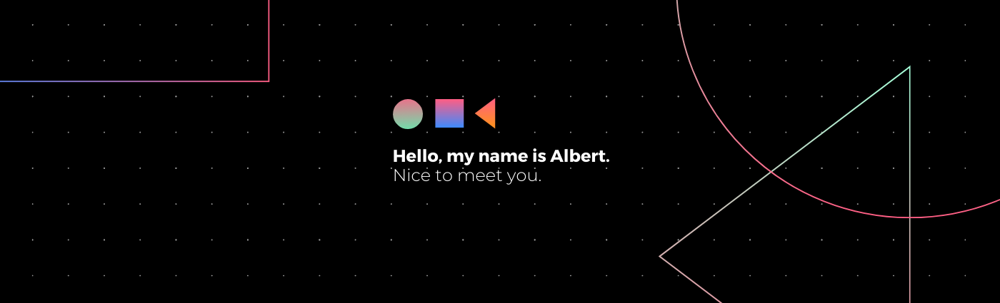

### Hi there I'm Albert 

- 🔭 I’m currently working on ...
- 🌱 I’m currently learning ...
- 👯 I’m looking to collaborate on ...
- 🤔 I’m looking for help with ...
- 💬 Ask me about ...
- 📫 How to reach me: ...
- 😄 Pronouns: ...
- ⚡ Fun fact: ...

<!--   -->

<h3 align="left">Connect with me:</h3>

  &nbsp;
<h3 align="left">Languages and Tools:</h3>

 
 
 

